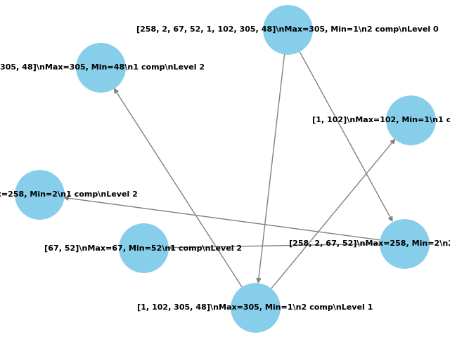

# Trabalho Individual 2 - MaxMin Select

## Descrição do Projeto

Este projeto implementa o algoritmo **MaxMin Select** em Python, que utiliza a técnica de divisão e conquista para encontrar simultaneamente o maior e o menor elementos de uma sequência de números. O algoritmo reduz o número de comparações em relação a uma abordagem ingênua, dividindo a lista em subproblemas menores e combinando os resultados recursivamente.

### Lógica do Algoritmo (Explicação Linha a Linha)

Aqui está a explicação detalhada do código, organizada em seções expansíveis com formatação aprimorada para melhor estética:

<details>
<summary><b><span style="color:#2ecc71">Linhas 1-3: Importação das Bibliotecas</span></b></summary>

<br>

- <b><span style="color:#27ae60">`matplotlib.pyplot as plt`</span></b>: Usada para <i>salvar o diagrama como imagem</i> no formato PNG.  
- <b><span style="color:#27ae60">`networkx as nx`</span></b>: Biblioteca essencial para <i>criar e manipular grafos</i>, representando a árvore de recursão.  
- <b><span style="color:#27ae60">`os`</span></b>: Utilizada para <i>verificar e criar diretórios</i>, como a pasta `assets`.

</details>

<details>
<summary><b><span style="color:#3498db">maxmin_select(arr, low, high, G=None, parent=None, level=0)</span></b></summary>

<br>

#### Inicialização e Estrutura do Grafo
- <b>Linha 5</b>: Define a função principal do algoritmo <i><span style="color:#3498db">MaxMin Select</span></i>, recebendo:  
  - O <b>`array`</b> de entrada.  
  - Índices <b>`low`</b> e <b>`high`</b>.  
  - Grafo <b>`G`</b> (inicialmente <i>`None`</i>).  
  - Nó pai <b>`parent`</b> e nível de recursão <b>`level`</b>.  
- <b>Linhas 6-7</b>: Se <b>`G`</b> é <i>`None`</i> (primeira chamada), inicializa um <i>grafo direcionado</i> com <b>`nx.DiGraph()`</b>.  
- <b>Linha 9</b>: Gera um ID único (<b>`node_id`</b>) usando <b>`low`</b> e <b>`high`</b>.  
- <b>Linha 10</b>: Cria o <i>rótulo inicial</i> do nó com o subarray e o nível.  
- <b>Linha 11</b>: Adiciona o nó ao grafo com o rótulo inicial.  
- <b>Linhas 13-14</b>: Conecta o nó atual ao <b>`parent`</b> com uma <i>aresta</i>, estruturando a árvore.  
- <b>Linha 16</b>: Imprime o nível de recursão atual e o subarray sendo processado, ajudando na depuração.

#### Casos Base
- <b>Linhas 18-21 (Caso Base 1)</b>: Se <b>`low == high`</b> (um elemento):  
  - Atualiza o rótulo com o valor como <i>máximo</i> e <i>mínimo</i>.  
  - Imprime uma mensagem indicando o caso base com um elemento.  
  - Retorna esses valores e o grafo.  
- <b>Linhas 23-29 (Caso Base 2)</b>: Se <b>`high == low + 1`</b> (dois elementos):  
  - Compara <b>`arr[low]`</b> e <b>`arr[high]`</b>:  
    - Se <b>`arr[low] > arr[high]`</b>, <b>`max_val = arr[low]`</b> e <b>`min_val = arr[high]`</b>, senão o inverso.  
  - Atualiza o rótulo com <i>máximo</i>, <i>mínimo</i> e <b>1 comparação</b> (<i>`1 comp`</i>).  
  - Imprime uma mensagem com os dois elementos, o máximo e o mínimo calculados.  
  - Retorna os valores e o grafo.

#### Divisão e Conquista
- <b>Linha 31</b>: Calcula o <i>ponto médio</i> (<b>`mid`</b>) para dividir o array.  
- <b>Linhas 32-33</b>: Executa chamadas <i>recursivas</i> de <b>`maxmin_select`</b>:  
  - Metade esquerda: <b>`low`</b> a <b>`mid`</b>.  
  - Metade direita: <b>`mid + 1`</b> a <b>`high`</b>.  
  - Passa o nó atual como <b>`parent`</b> e incrementa o <b>`level`</b>.

#### Combinação
- <b>Linhas 35-36</b>: Combina os resultados:  
  - <i>Máximo final</i>: <b>`max(max1, max2)`</b>.  
  - <i>Mínimo final</i>: <b>`min(min1, min2)`</b>.  
  - Realiza <b>2 comparações</b>.  
- <b>Linha 37</b>: Atualiza o rótulo com o subarray, <i>máximo</i>, <i>mínimo</i> e <b>2 comp</b>.  
- <b>Linha 39</b>: Imprime o nível de recursão, o subarray combinado, o máximo e o mínimo calculados.  
- <b>Linha 41</b>: Retorna <i>máximo</i>, <i>mínimo</i> e o grafo.

</details>

<details>
<summary><b><span style="color:#3498db">find_max_min(arr)</span></b></summary>

<br>

#### Execução e Validação
- <b>Linha 44</b>: Define uma função auxiliar que retorna <b>`None`</b> se o array estiver <i>vazio</i>.  
- <b>Linha 47</b>: Chama <b>`maxmin_select`</b> com índices <b>0</b> e <b>`len(arr) - 1`</b>, obtendo <i>máximo</i>, <i>mínimo</i> e o grafo.

#### Geração do Diagrama
- <b>Linha 50</b>: Define a <i>posição dos nós</i> com <b>`spring_layout`</b> e <b>`k=50`</b> para espaçamento.  
- <b>Linha 51</b>: Extrai os <i>rótulos</i> dos nós do grafo.  
- <b>Linha 52</b>: Desenha o grafo com <b>`nx.draw`</b>, ajustando:  
  - <i>Tamanho dos nós</i>, <i>cores</i>, <i>fonte</i> e <i>arestas</i>.  
- <b>Linha 53</b>: Salva o diagrama em <b>`diagrama_maxmin.png`</b> na raiz do projeto.  
- <b>Linha 54</b>: Fecha a figura para <i>liberar memória</i>.

#### Retorno
- <b>Linha 56</b>: Retorna o <i>máximo</i> e o <i>mínimo</i>.

</details>

<details>
<summary><b><span style="color:#e67e22">Teste (Linhas 58-63)</span></b></summary>

<br>

- Define um <i>array de teste</i> com <b>8 elementos</b>: `[258, 2, 67, 52, 1, 102, 305, 48]`.  
- Chama <b>`find_max_min`</b> para calcular o <i>máximo</i> e o <i>mínimo</i>.  
- Exibe o <i>array</i>, o <i>máximo</i>, o <i>mínimo</i> e uma mensagem confirmando a geração do diagrama em <b>`/diagrama_maxmin.png`</b>.

</details>

## Como Executar o Projeto

1. **Pré-requisitos**: Certifique-se de ter o Python 3.x instalado no seu ambiente.
2. **Clone o repositório**:
   ```bash
   git clone https://github.com/DaviAguilar/trabalho_individual_2_FPAA.git
   cd trabalho_individual_2_FPAA
3. **Execute o código**:
   ```bash
   python main.py
   ```
4. **Saída esperada**: O programa exibirá o maior e o menor elementos de cada array de teste.

## Relatório Técnico

### Análise da Complexidade Assintótica - Método de Contagem de Operações

O algoritmo MaxMin Select divide a lista em duas partes e faz comparações em cada nível da recursão. Vamos analisar o número de comparações:

- **Caso base (2 elementos)**: 1 comparação.
- **Divisão**: A lista de tamanho \( n \) é dividida em duas sublistas de tamanho \( n/2 \).
- **Combinação**: Após as chamadas recursivas, são feitas 2 comparações (uma para o máximo e outra para o mínimo).

**Contagem de comparações**:
- Nível 0: \( n \) elementos, 2 comparações na combinação.
- Nível 1: \( n/2 \) elementos por sublista, 2 sublistas, total de \( 2 \times 1 = 2 \) comparações.
- Nível 2: \( n/4 \) elementos por sublista, 4 sublistas, total de \( 4 \times 1 = 4 \) comparações.
- Até o nível \( \log_2 n \), onde cada sublista tem 2 elementos (1 comparação).

A recursão forma uma árvore binária com altura \( \log_2 n \). O número total de comparações é:
- Para \( n \) par, aproximadamente \( 3n/2 - 2 \) comparações (derivado de análises teóricas).
- Complexidade temporal: \( O(n) \), pois o número de comparações é proporcional a \( n \).

### Análise da Complexidade Assintótica - Teorema Mestre

A recorrência do algoritmo é:
\[ T(n) = 2T(n/2) + O(1) \]

1. **Identificação dos parâmetros**:
   - \( a = 2 \) (número de subproblemas).
   - \( b = 2 \) (fator de divisão do tamanho do problema).
   - \( f(n) = O(1) \) (custo da combinação, 2 comparações constantes).

2. **Cálculo de \( \log_b a \)**:
   - \( \log_2 2 = 1 \), então \( p = 1 \).

3. **Casos do Teorema Mestre**:
   - Comparar \( f(n) = O(1) \) com \( n^p = n^1 = O(n) \).
   - \( O(1) < O(n) \), então aplica-se o **Caso 1**: \( T(n) = \Theta(n^p) \).

4. **Solução assintótica**:
   - \( T(n) = \Theta(n^1) = \Theta(n) \).

Portanto, a complexidade é \( O(n) \), confirmando a análise por contagem.

## Diagrama

Um diagrama ilustrando a recursão está disponível em `/diagrama_maxmin.png`. Ele mostra:
- Divisão da lista em subproblemas.
- Combinação dos resultados.
- Níveis da árvore de recursão e comparações.



- Outra forma de visualizar 


---
